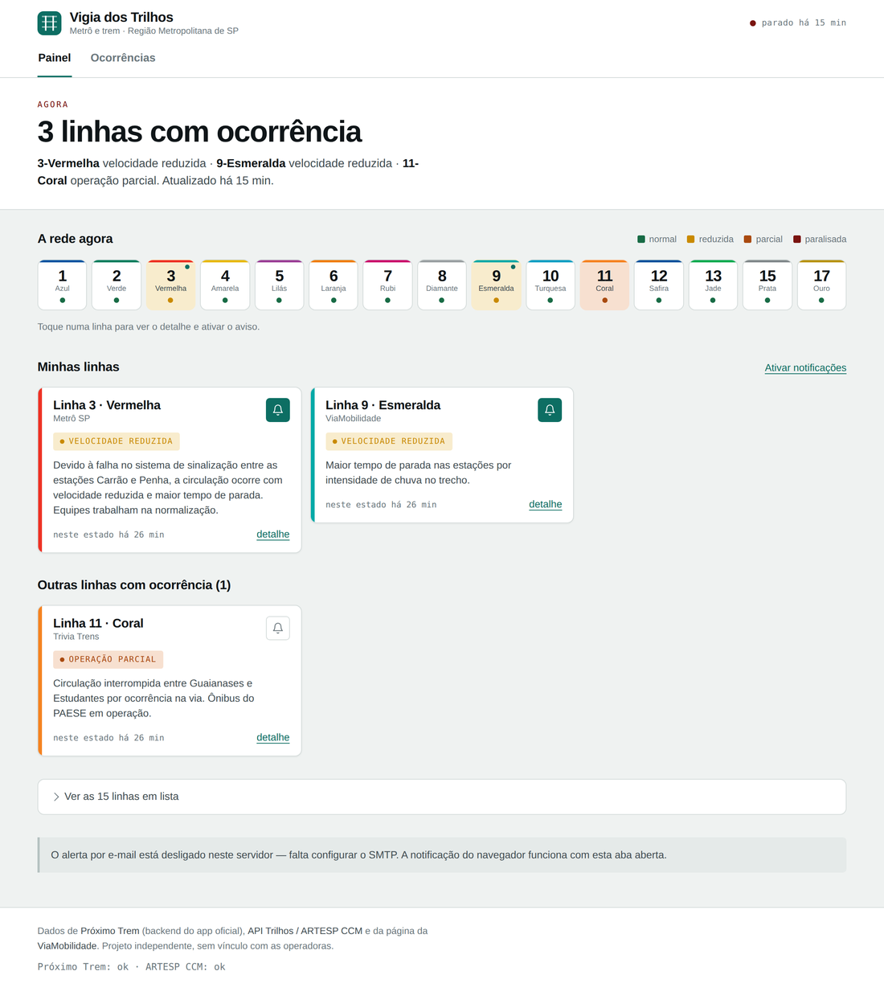
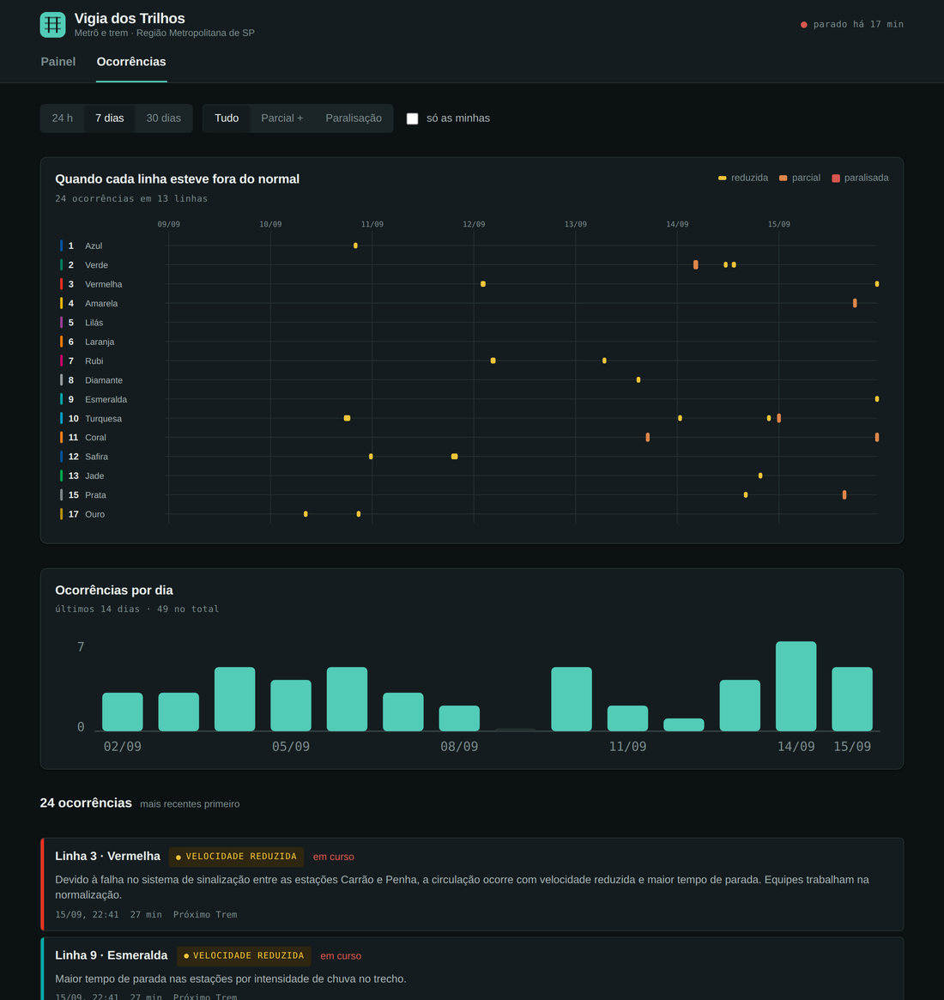

# Vigia dos Trilhos

Monitor das 15 linhas de metrô e trem da Região Metropolitana de São Paulo. Avisa pelo
navegador enquanto a aba estiver aberta e por e-mail sempre.

Flask + SQLite, sem dependência além do Flask. Roda local com um comando.



## Como a interface está organizada

O princípio é simples: **o que está fora do normal sobe e cresce, o que está normal
encolhe**. Uma grade com quinze cartões iguais trata uma linha paralisada e uma linha
tranquila com o mesmo peso visual, e é justamente isso que um monitor não pode fazer.

**Painel.** Abre com uma manchete que responde a pergunta antes de você ler qualquer
outra coisa — *"3 linhas com ocorrência"* ou *"Rede operando normalmente"* — seguida de
quais linhas e desde quando. Abaixo vem **A rede agora**: as quinze linhas em peças
compactas, cada uma na sua cor oficial, tingidas pela gravidade do estado. É o único
lugar que mostra a rede inteira de uma vez, e serve de navegação — toque numa peça e a
gaveta de detalhe abre com o histórico daquela linha dos últimos 7 dias.

Depois vêm só os cartões que importam: **Minhas linhas** (que na primeira visita é o
convite para escolher) e **Outras linhas com ocorrência**. As linhas em operação normal
não viram cartão nenhum — ficam na lista recolhida no pé da página, a um clique de
distância. Quando não há ocorrência alguma, o painel diz isso e para de falar.

**Ocorrências.** O gráfico de faixas mostra *quando* cada linha esteve fora do normal na
janela escolhida, uma linha por linha, com a espessura do bloco codificando a gravidade
além da cor — é onde padrões aparecem: o horário de pico, o dia de chuva em que meia rede
degrada junto. Abaixo, a contagem por dia e a lista detalhada, ambas obedecendo aos
mesmos filtros de período, gravidade e "só as minhas".



---

## Rodar local

```bash
pip install -r requirements.txt
cp .env.example .env          # opcional; sem isso os padrões já servem
python3 app.py                # http://localhost:8000
```

Na primeira subida o histórico está vazio — ele começa a existir a partir do momento
em que o coletor liga. Para conhecer a interface antes disso:

```bash
SEMEAR_DEMO=1 python3 app.py
```

Teste de fumaça, com fonte simulada e sem tocar a rede:

```bash
python3 teste_local.py
```

---

## De onde vêm os dados

| Fonte | Cobertura | Autenticação | Papel |
|---|---|---|---|
| **Próximo Trem** — backend do app oficial | 15 linhas | nenhuma | primária, 1 poll/min |
| **API Trilhos** — ARTESP CCM | linhas 4, 5, 6, 7, 8, 9 | `Api-Key`, 12 req/h | conferência e histórico oficial |
| **viamobilidade.com.br** — raspagem do HTML | 14 linhas | nenhuma | fallback quando a primária falha |

Quando duas fontes reportam a mesma linha, vale a de maior prioridade
(`PRIORIDADE_FONTE` em `fontes.py`); a discordância fica registrada como divergência,
que costuma ser o primeiro sinal de que uma das fontes travou.

A ARTESP só é consultada a cada `ARTESP_INTERVALO_MIN` minutos (padrão 10), porque o
teto de 12 requisições por hora não aguenta poll contínuo. O botão *Histórico oficial
ARTESP* na aba de ocorrências gasta uma dessas requisições de propósito, a pedido.

---

## Hospedar de graça

O app precisa de três coisas que nem toda hospedagem gratuita entrega: **saída HTTP
para hosts arbitrários**, **um processo que acorde de tempos em tempos** e **um arquivo
gravável**. O desenho abaixo resolve as três em qualquer plataforma.

### Recomendado: Render + cron-job.org

O plano gratuito do Render derruba o serviço depois de 15 minutos sem tráfego. Em vez
de lutar contra isso, use a favor: um cron externo bate numa URL a cada 5 minutos, o
que **acorda o serviço e executa a coleta na mesma requisição**.

O `render.yaml` na raiz já descreve o serviço inteiro, então o deploy é um Blueprint —
você não preenche nada à mão além dos segredos.

1. Suba este repositório no GitHub.
2. No Render: **New → Blueprint** → escolha o repositório. Ele lê o `render.yaml`,
   monta o serviço e pergunta as variáveis marcadas como `sync: false`
   (`SITE_URL` e os campos de SMTP; `ARTESP_API_KEY` pode ficar em branco).
3. Deploy. Depois, em **Environment**, copie o valor de `CRON_TOKEN` — o Render gera
   um sozinho no primeiro deploy.
4. Em [cron-job.org](https://cron-job.org) (grátis), crie um job de 5 em 5 minutos
   apontando para `https://<seu-app>.onrender.com/api/cron/poll?token=<o token>`.

O passo 4 não é opcional: com `POLL_SEGUNDOS=0` no Blueprint, o cron é a única coisa
que dispara a coleta. Se preferir a thread interna, troque para `POLL_SEGUNDOS=60` —
mas aí o serviço hiberna depois de 15 minutos sem visita e o polling para junto.

Trânsito a cada 5 minutos mantém o serviço acordado, e 24 h por dia dão cerca de 730
horas/mês — dentro das 750 gratuitas, mas sem folga para um segundo serviço na mesma
conta.

**O disco do Render gratuito é efêmero:** o `vigia.db` é zerado a cada deploy ou
reinício. As inscrições de e-mail e o histórico local se perdem junto. Se isso
incomodar, as saídas são anexar um disco pago, apontar `VIGIA_DB` para um volume onde
houver um, ou aceitar que o histórico longo mora na ARTESP e o local é só a janela
recente.

### PythonAnywhere: cuidado

O plano gratuito só alcança sites de uma **allowlist**, e nem o host do Próximo Trem
nem o da ARTESP estão nela — as requisições falham silenciosamente. Dá para pedir a
inclusão de um domínio, e a ARTESP tem chance razoável por ser uma API pública
documentada, mas o endpoint do Próximo Trem dificilmente entra. Além disso, a conta
gratuita permite **uma tarefa agendada por dia**, o que não sustenta o polling. Se o
destino for PythonAnywhere, conte com o plano pago.

### Outras

Qualquer plataforma que rode um processo Python com saída HTTP livre serve: Fly.io
(tem volume gratuito, o que resolve a persistência), Koyeb, Hugging Face Spaces com
Docker. Em todas, o par `POLL_SEGUNDOS=0` + cron externo é o arranjo mais resistente.

---

## Notificações

**Navegador.** O botão *Ativar notificações* pede permissão; a partir daí, toda vez que
uma linha seguida muda de estado, aparece um aviso do sistema. Funciona só com a aba
aberta — é a limitação da Notification API sem service worker. As linhas seguidas ficam
no `localStorage`, então são por navegador, não por conta.

**E-mail.** Preencha o bloco SMTP e a interface libera o formulário de inscrição. Cada
e-mail tem uma inscrição; reinscrever sobrescreve as preferências. Todos os eventos de
um mesmo ciclo viram **uma** mensagem, e a tabela `envios` garante que o mesmo evento
nunca é enviado duas vezes. Todo e-mail carrega um link de cancelamento.

No Gmail: ative a verificação em duas etapas e gere uma **senha de app** — a senha da
conta não funciona em SMTP.

---

## API

| Rota | O que faz |
|---|---|
| `GET /api/estado` | estado corrente das 15 linhas, última coleta e saúde das fontes |
| `GET /api/ocorrencias` | histórico local. `linhas=3,9` · `dias=7` · `severidade=1..3` · `abertas=1` · `limite` · `offset` |
| `GET /api/ocorrencias/artesp` | histórico oficial. Consome 1 das 12 requisições/hora |
| `GET /api/linha-do-tempo?dias=7` | blocos de ocorrência por linha, recortados na janela — alimenta o gráfico de faixas |
| `GET /api/serie?dias=14` | contagem de ocorrências por dia, para o gráfico |
| `GET /api/saude` | diagnóstico: atraso da coleta, estado de cada fonte, contagens |
| `GET /api/linhas` | catálogo das linhas, estados possíveis e nomes das fontes |
| `POST /api/inscricoes` | `{email, linhas: [3,9], severidade: 1}` |
| `GET\|POST /api/cron/poll` | executa um ciclo. `?token=` se `CRON_TOKEN` estiver definido |

---

## Como a detecção funciona

Cada ciclo compara a leitura nova com o estado guardado. Quando o estado muda, o evento
anterior é fechado com duração calculada e, se o novo estado for anômalo, um evento novo
é aberto. Os seis estados canônicos, com severidade entre parênteses:

`normal` (0) · `encerrada` (0) · `desconhecido` (1) · `reduzida` (1) · `parcial` (2) ·
`paralisada` (3)

Duas decisões que valem explicar:

**Linha que some do payload vira `desconhecido`, nunca `normal`.** A API às vezes para
de listar uma linha em vez de reportar o problema dela; tratar ausência como normalidade
seria a forma mais silenciosa de errar.

**O coletor parado é a anomalia mais importante.** `/api/saude` marca `coletor_ok` como
falso quando passam 15 minutos sem coleta, e o pulso no topo da página fica vermelho. Um
monitor que fica cego em silêncio é pior que nenhum monitor.

O que ainda não existe aqui, e é o passo seguinte natural: comparar a duração corrente
contra o p95 histórico da mesma linha por faixa horária e dia da semana, e contar
eventos numa janela móvel contra o baseline. Para isso a `eventos` já guarda tudo o que
é preciso — inclusive `is_peak` e `weekday` na tabela, prontos para uso.

---

## Estrutura

```
app.py            servidor Flask, ciclo de coleta, rotas
fontes.py         os três coletores, catálogo das linhas, normalização de status
dados.py          SQLite: estado, eventos, inscrições, saúde
alertas.py        envio de e-mail por SMTP
teste_local.py    teste de fumaça com fonte simulada
templates/        index.html e a página de cancelamento
static/           estilo.css e app.js
render.yaml       Blueprint do Render: serviço, comandos e variáveis
Procfile          comando de start para plataformas que leem Procfile
.python-version   versão do Python usada no build
.env.example      todas as variáveis, comentadas
```

---

## Ressalvas

Os termos de uso do Portal CCM falam em cópia temporária para uso pessoal e não
comercial, e não tratam explicitamente de coleta automatizada nem de guardar histórico.
Se este app for ao ar publicamente, vale perguntar à ARTESP pelo canal do portal. Se ele
exibir fotos do portal, elas exigem marca d'água intacta e o crédito
"Fonte: Portal CCM – ARTESP (ccm.artesp.sp.gov.br)".

O endpoint do Próximo Trem não é documentado nem tem contrato público: pode mudar de
formato, passar a exigir chave ou sumir sem aviso. É por isso que o fallback de raspagem
existe. Projeto independente, sem vínculo com Metrô, CPTM, ARTESP ou concessionárias.
